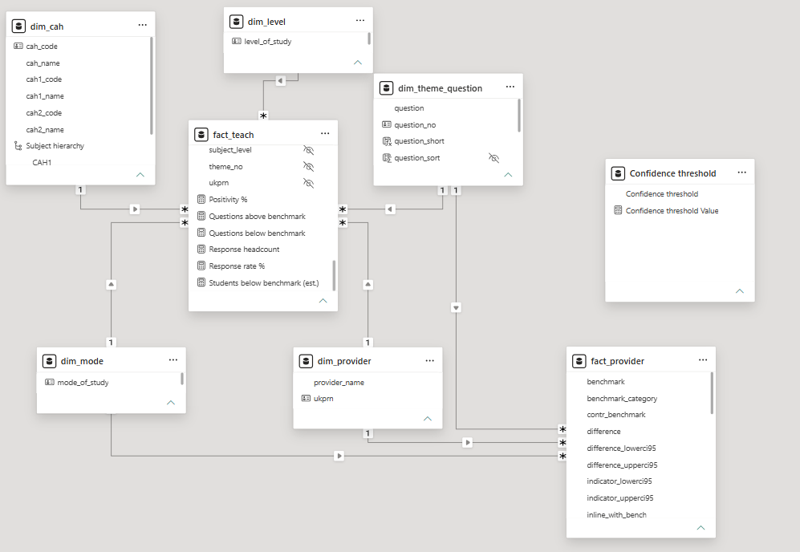
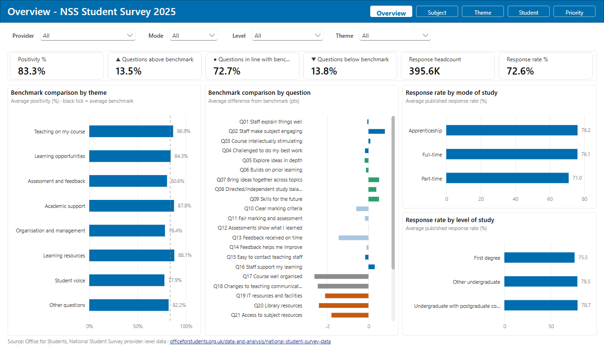
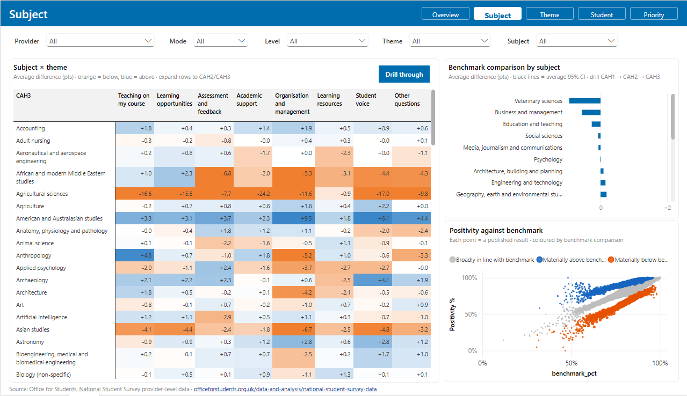
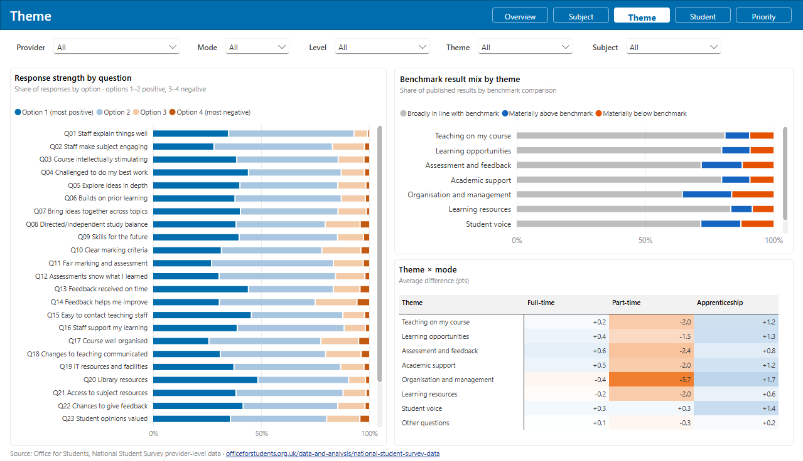
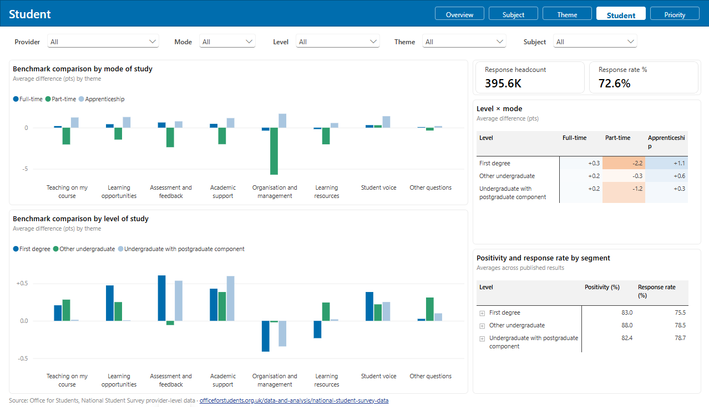
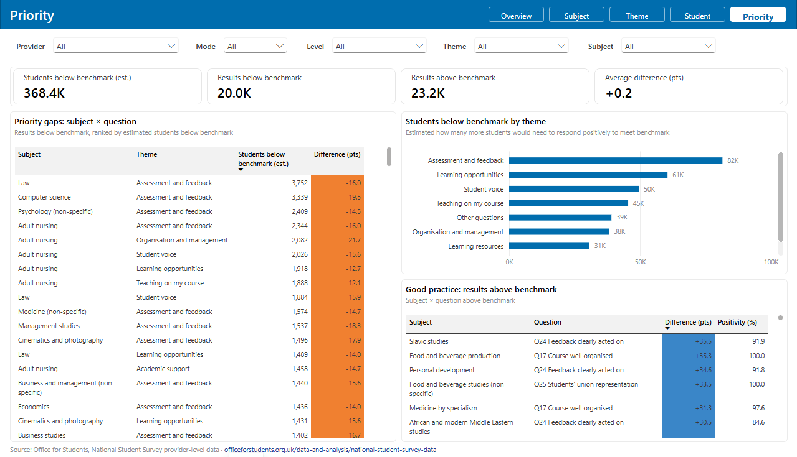
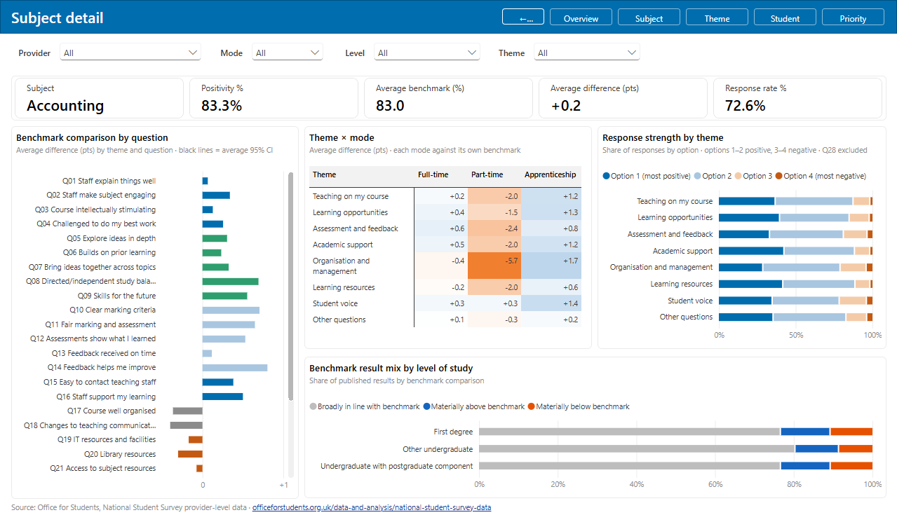
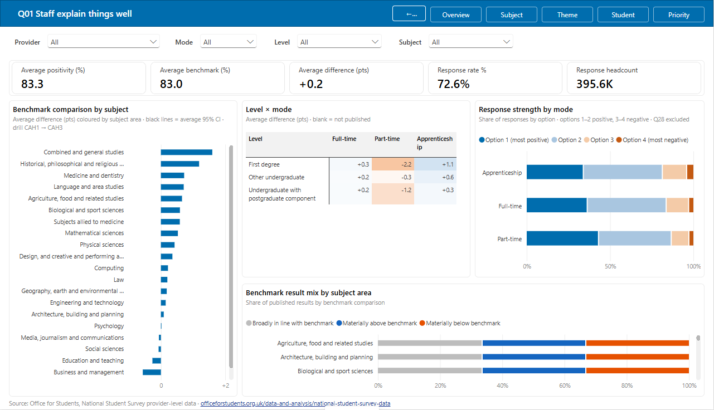

> **TL;DR.** I turned the UK Office for Students (OfS)' National Student Survey (NSS) provider-level release into a star-schema Power BI dashboard. It answers one question for any provider, subject, study mode or level of study: **where are students less positive than expected, and how many students does that gap affect?**

[**View the dashboard**](https://drive.google.com/file/d/1OMazN9uhBqr9OlCro-XcBRCRmQ0mPWM7/view?usp=sharing) | [**Code on GitHub**](https://github.com/linhngo66/nss-dashboard) | [**Data source (OfS)**](https://www.officeforstudents.org.uk/data-and-analysis/national-student-survey-data/)

## The scenario

Imagine you're on a university's student experience team. The NSS results come out every year, and you want to know where your students are less happy than they should be, and where to start fixing things.

The questions I set out to answer:

1. How are we doing against our benchmarks overall, and in which areas?
2. Which subjects are falling behind, and is it a problem across the board or in one area?
3. Within each area, which questions are dragging the score down?
4. Do full-time, part-time and apprenticeship students have a different experience?
5. Which gaps affect the most students, and where are we already doing well?

The data is the OfS NSS 2025 provider-level release: 433 providers, 163 subjects, and undergraduates studying full-time, part-time or through an apprenticeship. Every result comes with an OfS benchmark, which is the score you'd expect given that provider's mix of subjects and students. That's what makes fair comparisons possible.

## Executive summary

I built a Power BI dashboard that compares every result with its benchmark. It has five pages you can filter by provider, mode, level, theme and subject, plus two drill-through pages for a closer look at a single subject or question.

Key findings:

- **Organisation and management is the weakest area.** It's the theme furthest below benchmark, and part-time students feel it most. Courses not being well organised and changes not being communicated well are the two questions pulling it down.
- **A handful of subjects do much worse than the rest.** They tend to sit in social sciences, education and healthcare.
- **Part-time students have the worst experience, and apprentices the best.** That holds in every theme: part-time students are below benchmark across the board, and apprentices are above it.
- Across the sector, 83.3% of students answer positively and 72.6% took part in the survey. Most results (72.7%) are in line with benchmark, with 13.5% above and 13.8% below.

## Data, metrics and approach

| | |
|---|---|
| **Data** | 190,235 published results (provider × subject × level × mode × question), plus 17,941 provider-wide totals |
| **Metrics** | Positivity (share of students picking one of the top two answers), benchmark, difference from benchmark with a 95% confidence interval, response rate, and estimated students below benchmark |
| **Tools** | R (tidyverse, arrow) for cleaning, and Power BI (Power Query, DAX, PBIP) for the model and report |

How I got there:

1. **Cleaned** the two raw files in R into one fact table plus dimension tables.
2. **Modelled** them as a star schema in Power BI, with subject-level results and provider totals sharing the same provider, mode, level, subject and question dimensions.
3. **Built** one page per business question, with slicers that stay in sync across pages and drill-throughs for detail.

## The dashboard

## Assumptions and decisions

- **Benchmarks, not raw scores.** Providers have very different subject mixes and students, so I judge results by how far they are from benchmark, not by who scores highest.
- **Above or below only when it's clear-cut.** Following the OfS approach, a result only counts as above or below benchmark when it passes the confidence test. Everything else is in line.
- **"Students below benchmark" is about scale, not headcount.** It's the population multiplied by the gap, added up over questions, so one student can be counted on several questions.
