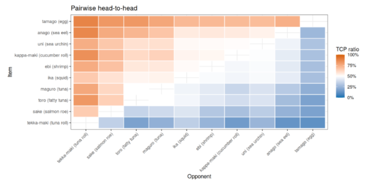
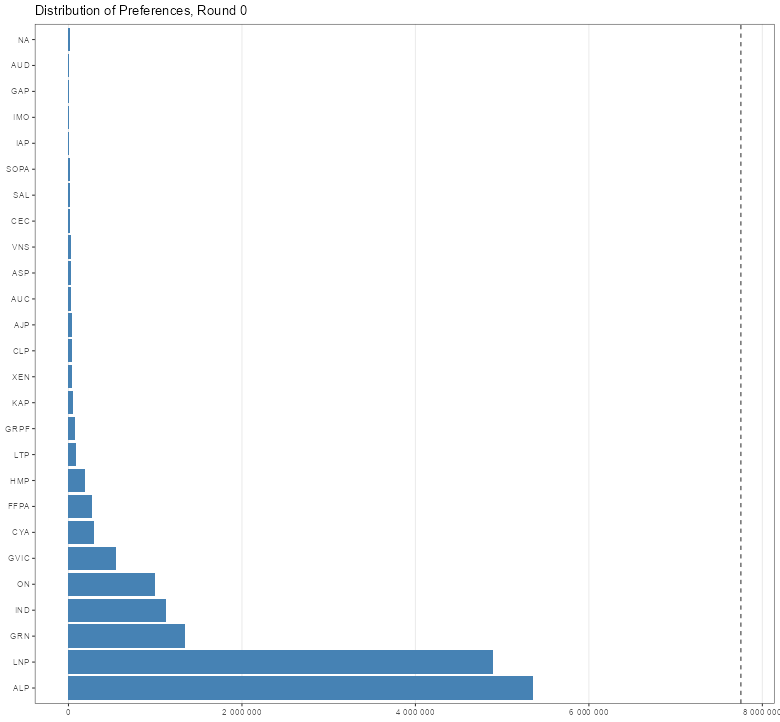

I recently explored the world of computational statistics, or put it simply, building softwares that implement statistical theories. For me, it was **building new visualization methods and softwares** that can help me better understand the data I'm working with.

[`prefviz`](https://numbats.github.io/prefviz/) is a new R package for interactively explore preferential data. Preferential data is data that expresses individuals preferences over a set of items, i.e., voters rank candidates in a ballot paper, customers rank product preference, atheletes are ranked in a tournament, etc. 

The primary example I used for the package and my successive analysis is the Australian election, where voters rank their preferences for candidates from the highest to the lowest.

**Why I built `prefviz`?**

- I found no existing R package that can help me explore the general structure of preferential data. The only found was not working properly, and the rest of related preferential packages are for outputs of their statistical models. However, how can one build a high-performing model without knowing the structure of the data?
- I want to compare *many* sets of preferences with each other, more than 100 sets. However, using the traditional visualization of bar plots mean I need to draw as many plot as there are sets of preferences, meaning more than 100 plots. How can one compare 100 plots with each other?
- I need a high-dimensional visualisation tool to explore the competition between many options in a single set of preferences. The existing workflow is rather inconvenient, and there are some presets I can package in functions so that I don't need to re-write the code.

**What I built**

Take the context of the Australian Federal Election, in which we have 150 electorates, each having their own election. Normally, we would have to draw 150 bar plots to compare the preferences of each electorate. However, a ternary plot can turn these 150 plots into 150 points in a shared space, and we can compare the preference structure of these electorates simply by comparing their positions on the ternary plot.

This is how to read a ternary plot: 

1. The position of the points is made up of 3 percentages, summing up to 100%. These percentages represent how much each option is preferred by the points.
2. The closer the points are to one of the vertices/corners, the higher the preference percentage towards that option. 
3. There are 3 separate regions on the plot called majority region. Points falling into the majority region have the majority preference towards the corresponding option.

Of course, there are more than 3 parties in the election. High-dimensional ternary plots arises to solve the problem. Simply put, all the points are living in a high-dimensional space, whose positions are made of the preferences of all the parties. However, human eyes can only perceive up to 3 dimensions, so we need to project the points into a lower-dimensional space using a tour projection method. Just like how you inspect an exhibit in a museum by walking around and looking at its different angles, the tour method literally gives you a tour around different angles/projections of the object, through which you hopefully can see the object structure.

**There are more than just ternary plots in the package**

You can also create a pairwise matrix of preference or quickly plot a preference distribution without much transformations because `prefviz` handles these transformations for you.

**More about `prefviz`**

Find out more about the package and its features via:

- [`prefviz` website](https://numbats.github.io/prefviz/)
- [`prefviz` presentation](https://linhngo66.github.io/prefviz-presentation/etc5543-final-presentation.html#/section)